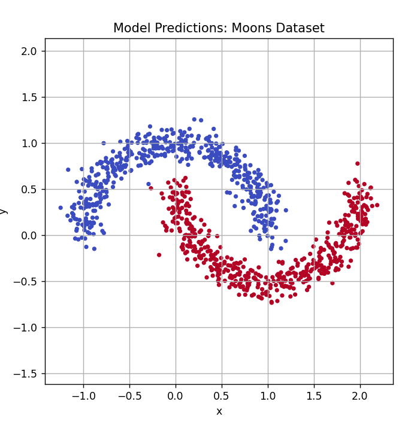

# 🌙 Moons Neural Network Classifier (PyTorch)

This is a personal project where I trained a neural network using PyTorch to classify data from the synthetic "moons" dataset — a classic example of a non-linearly separable problem.  
The goal was to visualize how a simple model learns curved decision boundaries.

---

## 🧠 What it does

- Uses `make_moons()` from `sklearn` to generate 2D curved data
- Trains a 2-layer neural network on noisy samples
- Tests prediction accuracy and visualizes decision regions
- Creates decision boundary heatmap and prediction plots

---

## 📸 Visual Examples

### 🔹 Model Predictions


### 🔹 Decision Boundary Heatmap


---

## ▶️ How to run

### 1. Install dependencies:

```bash
pip install -r requirements.txt
```

### 2. Train the model:

```bash
python train.py
```

### 3. Test the model:

```bash
python test.py
```

### 4. Visualize decision boundary:

```bash
python decision_boundary.py
```

---

## 📂 Project Structure

- `model.py`: PyTorch model definition
- `train.py`: Model training script with BCE loss
- `test.py`: Accuracy calculation and prediction plot
- `decision_boundary.py`: Heatmap of model confidence
- `saved_model/`: Trained `.pth` weights
- `images/`: Visual assets for README

---

## 📦 Included Model

The file `saved_model/moons_model.pth` is included and was trained entirely from scratch using synthetic data.  
It contains no private or proprietary information.

---

## 📌 Technologies Used

- PyTorch
- Matplotlib
- Scikit-learn
- Python 3.10+
